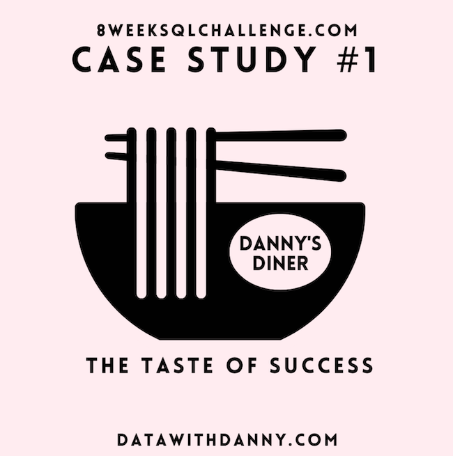
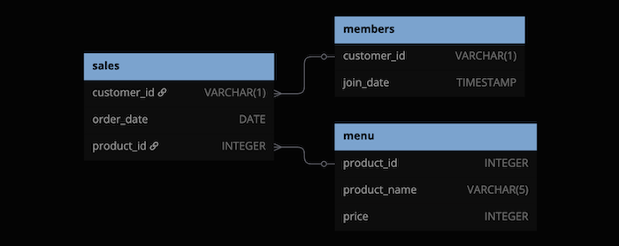

### Estudo de caso nº 1 - Danny's Diner

Nota: Este estudo de caso foi adquirido no site: [https://8weeksqlchallenge.com/](https://8weeksqlchallenge.com/) 
com o intuido de praticar o aprendizado da linguagem SQL.  

 

### Introdução

Danny ama comida japonesa, então, no começo de 2021, ele decide embarcar em um empreendimento arriscado e abre um 
pequeno e fofo restaurante que vende suas três comidas favoritas: sushi, curry e ramen.

O Danny's Diner precisa da sua ajuda para manter o restaurante funcionando. O restaurante coletou alguns dados muito 
básicos dos seus poucos meses de operação, mas não tem ideia de como usar esses dados para ajudar a administrar o negócio.

### Declaração do Problema

Danny quer usar os dados para responder a algumas perguntas simples sobre seus clientes, especialmente sobre seus 
padrões de visita, quanto gastaram e quais itens do cardápio são os seus favoritos. Ter essa conexão mais profunda 
com seus clientes o ajudará a proporcionar uma experiência melhor e mais personalizada para seus clientes fiéis.

Ele planeja usar esses insights para ajudá-lo a decidir se deve expandir o programa de fidelidade de clientes existente. 
Além disso, ele precisa de ajuda para gerar alguns conjuntos de dados básicos para que sua equipe possa inspecionar os 
dados facilmente sem precisar usar SQL.

Danny forneceu a você uma amostra de seus dados gerais de clientes devido a questões de privacidade, mas ele espera que 
esses exemplos sejam suficientes para que você escreva consultas SQL totalmente funcionais para ajudá-lo a responder 
suas perguntas!

Danny compartilhou com vocês três conjuntos de dados principais para este estudo de caso:
* sales
* menu
* members

Você pode inspecionar o diagrama de relacionamento de entidade e os dados de exemplo abaixo.

### Diagrama de Relacionamento de Entidades

### Examplos dos Datasets
Todos os conjuntos de dados existem dentro do dannys_diner esquema do banco de dados. Certifique-se de incluir essa referência 
em seus scripts SQL ao começar a explorar os dados e responder às perguntas do estudo de caso.

**Table 1: sales**  
A tabela sales captura todas as compras de nível com informações customer_id, order_date  e product_id correspondentes sobre quando e quais itens do menu 
foram pedidos. 

| customer_id | order_date | product_id |
|-------------|------------|------------|
| A           | 2021-01-01 | 1          |
| A           | 2021-01-01 | 2          |
| A           | 2021-01-07 | 2          |
| A           | 2021-01-10 | 3          |
| A           | 2021-01-11 | 3          |
| A           | 2021-01-11 | 3          |
| B           | 2021-01-01 | 2          |
| B           | 2021-01-02 | 2          |
| B           | 2021-01-04 | 1          |
| B           | 2021-01-11 | 1          |
| B           | 2021-01-16 | 3          |
| B           | 2021-02-01 | 3          |
| C           | 2021-01-01 | 3          |
| C           | 2021-01-01 | 3          |
| C           | 2021-01-07 | 3          |

**Table 2: menu**  
A tabela menu mapeia o product_id para o atual product_name e price de cada item do menu.

| product_id | product_name | price |
|------------|--------------|-------|
| 1          | sushi        | 10    |
| 2          | curry        | 15    |
| 3          | ramen        | 12    |

**Table 3: members**  
A tabela members registra join_date quando um customer_id aderiu à versão beta do programa de fidelidade 
Danny's Diner.

| customer_id | join_date  |
|-------------|------------|
| A           | 2021-01-07 |
| B           | 2021-01-09 |

#### Perguntas do estudo de caso
Cada uma das seguintes perguntas do estudo de caso pode ser respondida usando uma única instrução SQL:

1. Qual foi o valor total gasto por cada cliente no restaurante?
2. Há quantos dias cada cliente visita o restaurante?
3. Qual foi o primeiro item do menu comprado por cada cliente?
4. Qual é o item mais comprado do menu e quantas vezes ele foi comprado por todos os clientes?
5. Qual item foi o mais popular para cada cliente?
6. Qual item foi comprado primeiro pelo cliente depois que ele se tornou membro?
7. Qual item foi comprado pouco antes do cliente se tornar um membro?
8. Qual é o total de itens e valores gastos por cada membro antes de se tornar membro?
9. Se cada US$ 1 gasto equivale a 10 pontos e o sushi tem um multiplicador de pontos de 2x, quantos pontos cada cliente teria?
10. Na primeira semana após um cliente aderir ao programa (incluindo a data de adesão), ele ganha o dobro de pontos em todos os itens, 
não apenas em sushi. Quantos pontos os clientes A e B têm no final de janeiro?

